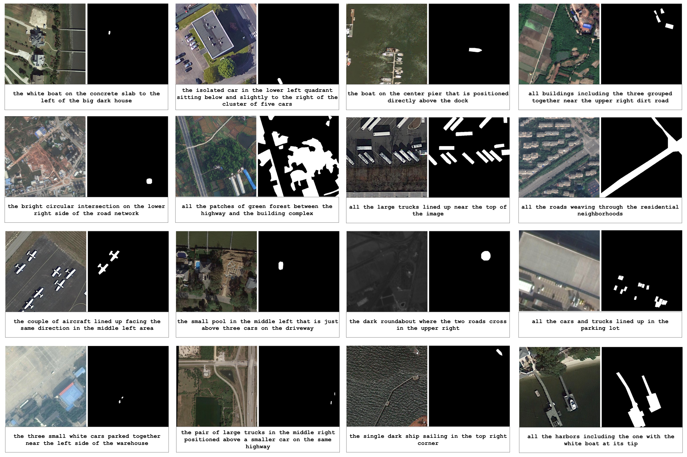

## AerialSeg: Open‑Vocabulary Aerial Image Segmentation with Referring Expressions

[](https://luispl77.github.io/aerialseg)
[](https://huggingface.co/datasets/luisml77/aerial-d)
[](#)



AerialSeg is an open‑source framework for segmenting aerial images from natural‑language prompts. It includes an automatic dataset pipeline (Aerial‑D), a SigLIP+SAM model (ClipSAM), and LLM tooling (Gemma3/O3) for expression enhancement and evaluation in remote sensing.

### Highlights
- **Dataset generation (Aerial‑D)**: iSAID + LoveDA → rule‑based expressions → uniqueness filtering → optional LLM enhancement
- **ClipSAM model**: SigLIP text/image encoders + SAM decoder, optional domain adaptation and LoRA fine‑tuning
- **LLM enhancement**: Gemma3/OpenAI pipelines for diverse, natural expressions used in training/evaluation
- **Viewers**: Flask tools to browse rule‑based and LLM‑enhanced annotations

---

## Aerial‑D Generation Pipeline

- Folder: `datagen/`
- Environment:
```bash
conda activate aerial-seg-datagen
# if you don't have it yet:
# conda create -n aerial-seg-datagen python=3.10 -y
pip install -r datagen/requirements.txt
```
- Data prerequisites:
  - Place iSAID under `datagen/isaid/`
  - Place LoveDA under `datagen/LoveDA/`
  - (Optional) DeepGlobe roads under `datagen/`

Generate the dataset:
```bash
cd datagen
./pipeline/run_pipeline.sh                      # full pipeline
./pipeline/run_pipeline.sh --num_images 100     # small sample
./pipeline/run_pipeline.sh --clean --zip        # optional cleanup + zip
```

Outputs:
- Written to `datagen/dataset/` (images, XML annotations with RLE masks, debug)
- Train/val splits as produced by the pipeline

View the results:
```bash
python utils/app.py --split train --port 5001       # LLM‑enhanced viewer
python utils/rule_viewer.py --split val --port 5002 # rule‑based viewer
```

Replicate the Aerial‑D release:
- Run the full pipeline including uniqueness filtering and historic processing (steps included in `run_pipeline.sh`)
- Optionally run LLM enhancement (see LLM section below) to add enhanced/unique expressions

---

## Model Training and Testing

- Folder: `clipsam/`
- Environment:
```bash
conda activate aerial-seg
# if you don't have it yet:
# conda create -n aerial-seg python=3.10 -y
pip install -r clipsam/requirements.txt
```
- Data: Use Aerial‑D outputs under `datagen/dataset/`

Train on Aerial‑D:
```bash
cd clipsam
python train.py --epochs 5 --batch_size 4 --lr 1e-4

# Optional: domain adaptation
python train.py --enable_grl --grl_lambda_schedule exponential

# Resume training (point to existing run folder)
python train.py --resume --custom_name <run_folder>
```

Expression selection (choose at most one):
```bash
python train.py --unique_only
python train.py --original_only
python train.py --enhanced_only
```

Train on Aerial‑D + four additional datasets (RRSISD, RefSegRS, NWPU‑Refer, Urban1960SatBench):
```bash
python train.py --use_all_datasets \
  --rrsisd_root ../datagen/rrsisd \
  --refsegrs_root ../datagen/refsegrs/RefSegRS \
  --nwpu_root ../datagen/NWPU-Refer \
  --urban1960_root ../datagen/Urban1960SatBench
```

Evaluate and visualize:
```bash
python test.py --model_name <checkpoint_dir_name>
python test.py --vis_only --num_vis 50
```

Checkpoints:
- Saved under `clipsam/models/clip_sam_YYYYMMDD_HHMMSS_epochs{N}_bs{B}_lr{LR}`

---

## LLM Fine‑Tuning Pipeline

- Folder: `llm/`
- Environment:
```bash
conda activate gemma3
# if you don't have it yet:
# conda create -n gemma3 python=3.10 -y
pip install -r llm/requirements.txt
```

Enhance expressions (optional):
```bash
cd llm
python gemma3_enhance.py --input_dir ../datagen/dataset --output_dir enhanced_output
python o3_enhance.py --dataset_dir ../datagen/dataset
```

Fine‑tune Gemma 3 with LoRA:
```bash
python gemma3_lora_finetune.py \
  --enhanced_data_dir enhanced_annotations_o3_dual \
  --model_name gemma-aerial-12b \
  --output_dir ./gemma-aerial-12b \
  --lora_r 64 --lora_alpha 16
```

Outputs:
- Fine‑tuned model directory under `llm/`
- Usable for generating/refining expressions to feed into training and evaluation

---

## Citations
If you use this repository, please cite the dataset and (when available) the thesis/paper.

```bibtex
@dataset{aerial-d-2024,
  title={AERIAL-D: Referring Expression Instance Segmentation in Aerial Imagery},
  author={Luis M. Lopes and contributors},
  year={2024},
  publisher={Hugging Face},
  url={https://huggingface.co/datasets/luisml77/aerial-d}
}
```

---

## Acknowledgments
- iSAID and LoveDA datasets
- Hugging Face Transformers, PyTorch, OpenCV, Flask
- SAM and SigLIP authors
- Google Gemma and OpenAI models used for language enhancement

---

## Contributing
Issues and pull requests are welcome. Please open an issue to discuss substantial changes.

## Contact
For questions, please open an issue on the repository.
