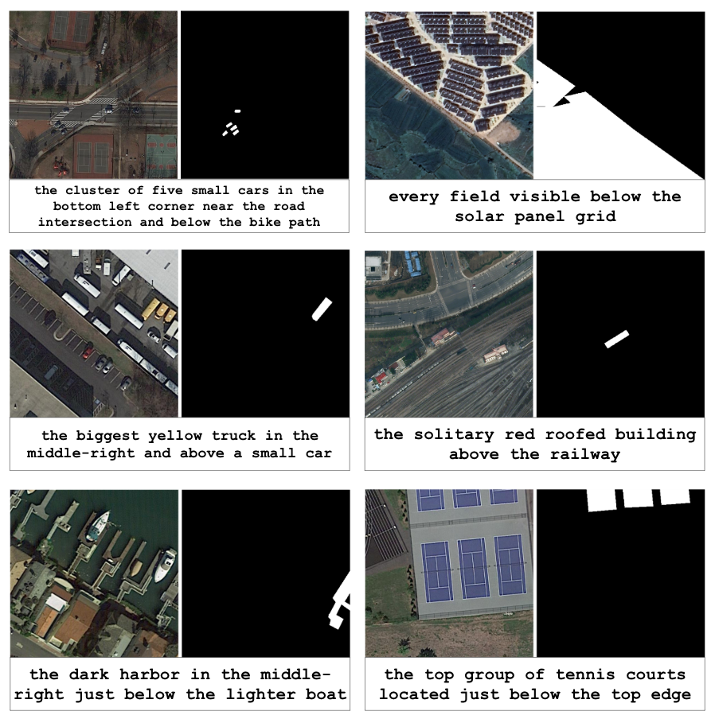
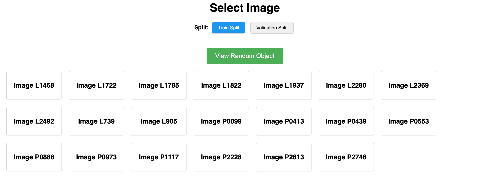
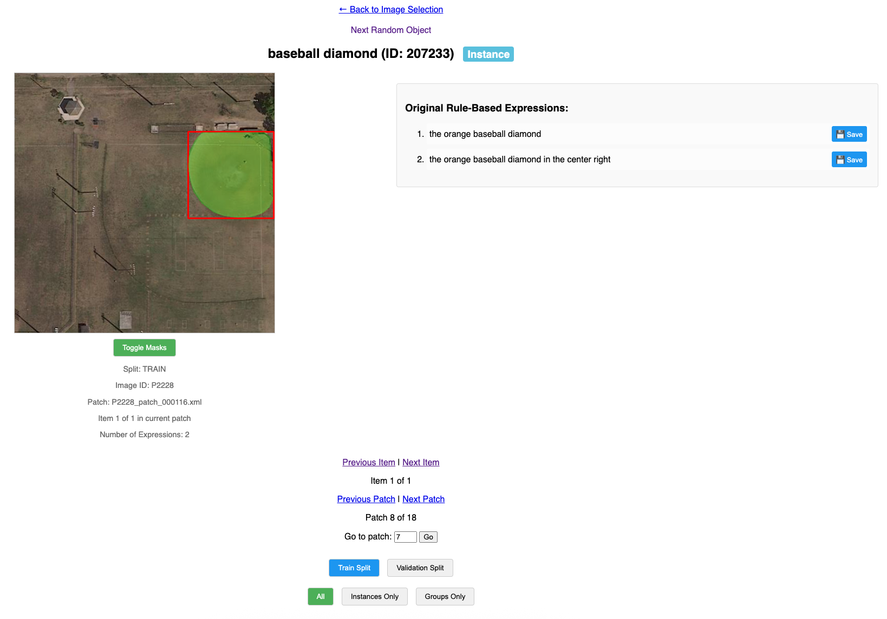
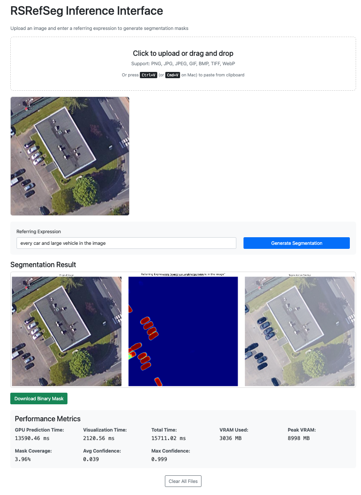

# Generalized Referring Expression Segmentation on Aerial Photos

<div align="center">

### 🔗 Quick Links

**[🌐 Project Page](https://luispl77.github.io/aerial-d)** | **[🤗 Aerial-D Dataset](https://huggingface.co/collections/luisml77/aerial-d-68a17e2431daebb96218edce)** | **[📄 Paper](https://www.arxiv.org/abs/2512.07338)**

[](https://luispl77.github.io/aerial-d)
[](https://huggingface.co/datasets/luisml77/aerial-d)
[](https://www.arxiv.org/abs/2512.07338)

</div>

<div align="center">

</div>

## Overview
This repository provides end-to-end tooling for *Generalized Referring Expression Segmentation on Aerial Photos* (submitted to IEEE Journal of Selected Topics in Applied Earth Observations and Remote Sensing, J-STARS). The project introduces:
- **Aerial-D**, a 37,288-image dataset with 1.52M referring expressions covering instances, groups, and semantic regions across 21 categories.
- **Automatic data generation**, combining rule-based templates with LLM rewriting to produce grounded language at scale while filtering ambiguous references.
- **Unified RSRefSeg training**, pairing SigLIP2 and SAM with LoRA adapters to learn from Aerial-D alongside RefSegRS, RRSIS-D, NWPU-Refer, and Urban1960SatSeg.

### 🤗 Hugging Face Collection
All public artifacts live in the [🤗 Aerial-D collection on Hugging Face](https://huggingface.co/collections/luisml77/aerial-d-68a17e2431daebb96218edce):
1. [luisml77/gemma-aerial-12b](https://huggingface.co/luisml77/gemma-aerial-12b) — Gemma3 finetuned weights for Step 7
2. [luisml77/aeriald_o3_500](https://huggingface.co/datasets/luisml77/aeriald_o3_500) — distilled 500-sample o3 dataset for Gemma3 distillation
3. [luisml77/aerial-d](https://huggingface.co/datasets/luisml77/aerial-d) — full dataset release
4. [luisml77/rsrefseg](https://huggingface.co/luisml77/rsrefseg) — RSRefSeg checkpoints (`rsrefseg_aerial-d.pt`, `rsrefseg_combined.pt`)

## Repository Structure
- `datagen/`: dataset extraction, rule-driven expression generation, historic filtering, and enhancement utilities.
- `rsrefseg/`: SigLIP+SAM training/testing, visualizations, and style-transfer experiments.
- `llm/`: Gemma3 enhancement pipeline, QLoRA fine-tuning, and OpenAI o3 reference scripts.
- `docs/`: project webpage files.
- `tex/`: LaTeX source for article and dissertation.

## Getting Started

### Environment Setup
**Option 1: Using Conda (recommended, requires Python 3.12)**
```bash
conda create -n aerial python=3.12
conda activate aerial
pip install -r requirements.txt
```

**Option 2: Using venv**
```bash
python3.12 -m venv .venv
source .venv/bin/activate
pip install -r requirements.txt
```

### Dataset Download/Generation
You can reproduce Aerial-D locally or download the public release.

**Download from Hugging Face**
```bash
huggingface-cli download luisml77/aerial-d --repo-type dataset --local-dir datagen/dataset
```

**Reproduce Locally - Complete Pipeline**

The dataset generation has two main phases:

**Phase 1: Rule-based Generation (Steps 1-6)**

First, download the source datasets:
```bash
cd ~/aerial-d/datagen/pipeline

# Download iSAID dataset (~20GB, train + val + test)
./download_isaid.sh

# Download LoveDA dataset (~2.5GB, train + val)
./download_loveda.sh
```

Then generate rule-based expressions:
```bash
cd ~/aerial-d/datagen

# Generate rule-based expressions (skipping LLM enhancement)
./pipeline/run_pipeline.sh --skip_step7 --clean

# For small test (10 images per split)
./pipeline/run_pipeline.sh --skip_step7 --num_images 10 --random_seed 42 --clean
```

**Phase 2: LLM Enhancement (Step 7)**

Step 7 requires either (A) running OpenAI o3 enhancement + finetuning your own Gemma3 model, or (B) downloading the pre-distilled Gemma3 model:

**Option A: Full LLM Pipeline (from scratch)**
```bash
cd ~/aerial-d/llm

# 1a. Generate high-quality o3 samples (requires OpenAI API key, ~$10.36 for 500 samples)
python o3_enhance.py --dataset_dir ../datagen/dataset

# OR 1b. Download pre-generated o3 samples (skip expensive o3 API calls)
huggingface-cli download luisml77/aeriald_o3_500 --repo-type dataset --local-dir enhanced_annotations_o3_dual

# 2. Finetune Gemma3 on o3 samples using QLoRA
python gemma3_lora_finetune.py \
  --enhanced_data_dir enhanced_annotations_o3_dual \
  --model_name gemma-aerial-12b \
  --output_dir ./gemma-aerial-12b \
  --lora_r 64 --lora_alpha 16

# 3. Start vLLM server with finetuned model
vllm serve ./gemma-aerial-12b --port 8000

# 4. Run Step 7 (in another terminal)
cd ~/aerial-d/datagen
python pipeline/7_vllm_enhance.py
```

**Option B: Using Pre-trained Gemma3 Model (faster)**
```bash
# 1. Download pre-distilled Gemma3 model
huggingface-cli download luisml77/gemma-aerial-12b --repo-type model --local-dir llm/gemma-aerial-12b

# 2. Start vLLM server with downloaded model
cd ~/aerial-d/llm
vllm serve ./gemma-aerial-12b --port 8000

# 3. Run Step 7 (in another terminal)
cd ~/aerial-d/datagen
python pipeline/7_vllm_enhance.py
```

**Package dataset (optional)**
```bash
cd ~/aerial-d/datagen
python pipeline/zip_dataset.py --base_dir dataset --zip_path aeriald.zip
```

The pipeline extracts iSAID/LoveDA patches, assigns rules (3×3 grid, relations, extremes, size cues), generates expressions, filters for uniqueness, and applies optional historic filters. Utilities for viewing and metrics live under `datagen/utils/`.

### Model Training and Evaluation (Aerial-D)
`model.py` defines the SigLIP2 + SAM architecture (RSRefSeg) with LoRA adapters. Training and testing use the dataset downloaded above.

```bash
# Train (writes checkpoint under rsrefseg/models/ by default)
cd ~/aerial-d/rsrefseg
python train.py --dataset_root ../datagen/dataset --custom_name aeriald_run

# Test the produced checkpoint
python test.py --model_name aeriald_run --dataset_type aeriald

# Or download published checkpoints from HuggingFace
huggingface-cli download luisml77/rsrefseg --repo-type model --local-dir models/

# Test with Aerial-D only checkpoint (rsrefseg_aerial-d.pt)
python test.py --model_name rsrefseg_aerial-d --dataset_type aeriald

# Test with combined multi-dataset checkpoint (rsrefseg_combined.pt, requires SAM ViT-Large)
python test.py --model_name rsrefseg_combined --dataset_type aeriald --sam_model facebook/sam-vit-large
```
The training script fine-tunes SigLIP2-SO400M and SAM-ViT (Base or Large) on Aerial-D only. The optional `--custom_name` flag controls the run folder name under `rsrefseg/models/`, which you pass to `test.py` for evaluation.

## Web Applications

### Dataset Browser

Browse the complete dataset with images, expressions, and segmentation masks through an interactive web interface:

```bash
cd ~/aerial-d/datagen
python utils/rule_viewer.py --port 5004
# Navigate to http://localhost:5004
```

<div align="center">


</div>

### Interactive Inference

Test trained models with your own images and referring expressions:

```bash
cd ~/aerial-d/rsrefseg
CUDA_VISIBLE_DEVICES=0 python utils/rsrefseg_inference_app.py \
  --model_name aeriald_run \
  --sam_model facebook/sam-vit-large \
  --port 5002
# Navigate to http://localhost:5002
```

<div align="center">

</div>

## Historic Image Filters
Training-time augmentations approximate monochrome, grainy, and sepia degradations through luminance conversion, gamma/contrast adjustments, and additive noise. Combined with Urban1960SatSeg, these filters preserve segmentation quality under archival conditions.

## Citation
If you use this dataset or code, please cite:

```bibtex
@article{marnoto2025aeriald,
  title={Generalized Referring Expression Segmentation on Aerial Photos},
  author={Marnoto, Luís and Bernardino, Alexandre and Martins, Bruno},
  journal={IEEE Journal of Selected Topics in Applied Earth Observations and Remote Sensing},
  year={2025},
  note={Submitted}
}
```

## Contributing
Issues and pull requests are welcome. Please open an issue before submitting substantial changes.

## Contact
- Luís Marnoto: [luis.marnoto.gaspar.lopes@tecnico.ulisboa.pt](mailto:luis.marnoto.gaspar.lopes@tecnico.ulisboa.pt)
- Alexandre Bernardino: [alexandre.bernardino@tecnico.ulisboa.pt](mailto:alexandre.bernardino@tecnico.ulisboa.pt)
- Bruno Martins: [bruno.g.martins@tecnico.ulisboa.pt](mailto:bruno.g.martins@tecnico.ulisboa.pt)

Or open a GitHub issue.
