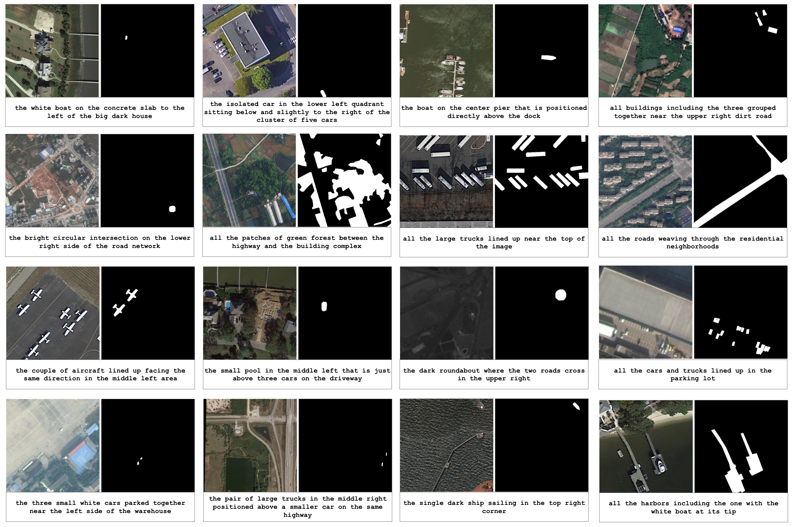

# Generalized Referring Expression Segmentation on Aerial Photos

[](https://luispl77.github.io/aerial-d)
[](https://huggingface.co/datasets/luisml77/aerial-d)
[](https://luispl77.github.io/aerial-d)



## Overview
AerialSeg delivers end-to-end tooling for the article *Generalized Referring Expression Segmentation on Aerial Photos*. The project introduces:
- **Aerial-D**, a 37,288-image dataset with 1.52M referring expressions covering instances, groups, and semantic regions across 21 categories.
- **Automatic data generation**, combining rule-based templates with LLM rewriting to produce grounded language at scale while filtering ambiguous references.
- **Unified RSRefSeg training**, pairing SigLIP2 and SAM with LoRA adapters to learn from Aerial-D alongside RefSegRS, RRSIS-D, NWPU-Refer, and Urban1960SatSeg.
- **Historic robustness**, using stochastic grayscale, sepia, and grain filters plus real historic imagery to maintain accuracy on archival photographs.

### Hugging Face Collection
All public artifacts live in the [Aerial-D collection on Hugging Face](https://huggingface.co/collections/luisml77/aerial-d):
- `luisml77/aerial-d` — full dataset release
- `luisml77/rsrefseg` — checkpoints (`rsrefseg_aerial-d.pt`, `rsrefseg_combined.pt`)
- `luisml77/gemma3-aerial-12b` — Gemma3 finetuned weights for Step 7
- `luisml77/aerial-d-o3-mini` — distilled o3 dataset used for Gemma3 training

## Repository Structure
- `datagen/`: dataset extraction, rule-driven expression generation, historic filtering, and enhancement utilities.
- `rsrefseg/`: SigLIP+SAM training/testing, visualizations, and style-transfer experiments.
- `llm/`: Gemma3 enhancement pipeline, QLoRA fine-tuning, and O3 reference scripts.
- `docs/`, `tex/`: documentation figures and manuscript sources.

## Getting Started

### Environment Setup
The project relies on dedicated conda environments per component:
- `conda activate aerial-seg-datagen` for `datagen/`
- `conda activate aerial-seg` for `rsrefseg/`
- `conda activate gemma3` for `llm/`

Install Python dependencies with the environment-specific `requirements.txt` files or use the root list for a monolithic setup.

### Dataset Generation
You can reproduce Aerial-D locally or download the public release.

**Download from Hugging Face**
```bash
huggingface-cli download luisml77/aerial-d --repo-type dataset --local-dir datagen/dataset
```

**Optional: rebuild locally**
```bash
cd /cfs/home/u035679/aerialseg/datagen
./pipeline/run_pipeline.sh --clean
# Package the result into aeriald.zip if needed
python pipeline/zip_dataset.py --base_dir dataset --zip_path aeriald.zip
```
The pipeline extracts iSAID/LoveDA patches, assigns rules (3×3 grid, relations, extremes, size cues), generates expressions, filters for uniqueness, and applies optional historic filters. Step 7 (`7_vllm_enhance.py`) expects the Gemma3 checkpoint produced in the **LLM Expression Enhancement** section; either complete those steps first or download the published `gemma3-aerial-12b` weights and run vLLM on that checkpoint before enabling Step 7. Utilities for viewing and metrics live under `datagen/utils/`.

### Model Training and Evaluation (Aerial-D)
`model.py` defines the SigLIP2 + SAM architecture (RSRefSeg) with LoRA adapters. Training and testing use the dataset downloaded above.

```bash
# Train (writes checkpoint under rsrefseg/models/ by default)
cd /cfs/home/u035679/aerialseg/rsrefseg
python train.py --dataset_root ../datagen/dataset --custom_name aeriald_run

# Test the produced checkpoint
python test.py --model_name aeriald_run --dataset_type aeriald

# Skip training: download the published Aerial-D checkpoint
huggingface-cli download luisml77/aerial-seg --repo-type model --local-dir models/rsrefseg_aeriald
python test.py --model_name rsrefseg_aeriald --dataset_type aeriald

# Evaluate the combined multi-dataset checkpoint (requires SAM ViT-Large)
huggingface-cli download luisml77/rsrefseg --repo-type model --local-dir models/rsrefseg_combined
python test.py --model_name rsrefseg_combined --dataset_type aeriald --sam_model facebook/sam-vit-large
```
The training script fine-tunes SigLIP2-SO400M and SAM-ViT (Base or Large) on Aerial-D only. The optional `--custom_name` flag controls the run folder name under `rsrefseg/models/`, which you pass to `test.py` for evaluation. Visualization-only and Flask inference utilities remain available under `rsrefseg/utils/`.

### LLM Expression Enhancement
```bash
cd /cfs/home/u035679/aerialseg/llm
python gemma3_enhance.py --input_dir ../datagen/dataset --output_dir enhanced_output
python o3_enhance.py --dataset_dir ../datagen/dataset

# QLoRA fine-tuning
python gemma3_lora_finetune.py \
  --enhanced_data_dir enhanced_annotations_o3_dual \
  --model_name gemma-aerial-12b \
  --output_dir ./gemma-aerial-12b \
  --lora_r 64 --lora_alpha 16
```
Gemma3-12B is distilled from 500 high-quality OpenAI o3 samples using QLoRA (~238× cheaper than direct o3 usage). The `llm/` directory also contains inference helpers, dataset cards, and scripts for managing Hugging Face artifacts.

## Historic Image Filters
Training-time augmentations approximate monochrome, grainy, and sepia degradations through luminance conversion, gamma/contrast adjustments, and additive noise. Combined with Urban1960SatSeg, these filters preserve segmentation quality under archival conditions.

## Cite Aerial-D
Please cite the dataset when using this repository:

```bibtex
@dataset{aerial-d-2024,
  title={Aerial-D: Referring Expression Segmentation for Aerial Imagery},
  author={Luis M. Lopes and contributors},
  year={2024},
  publisher={Hugging Face},
  url={https://huggingface.co/datasets/luisml77/aerial-d}
}
```

## Contributing
Issues and pull requests are welcome. Please open an issue before submitting substantial changes.

## Contact
For inquiries, email [maarnotto@gmail.com](mailto:maarnotto@gmail.com) or open a GitHub issue.
